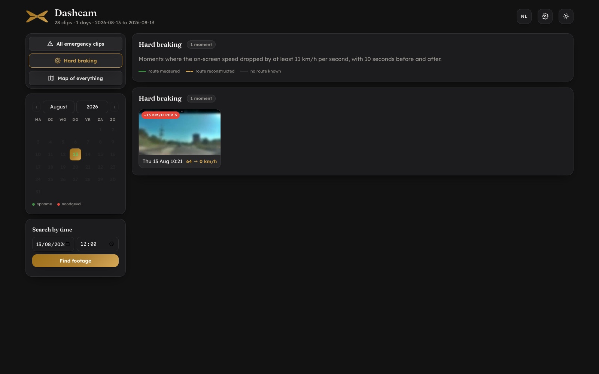
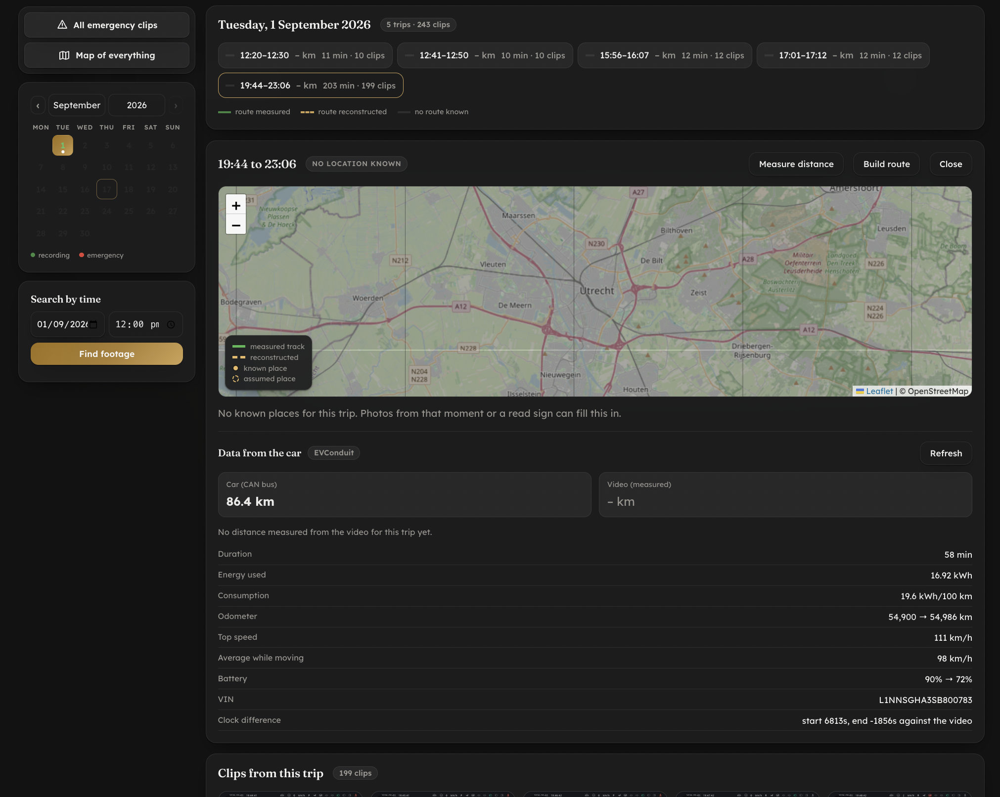

# XPENG Dashcam Viewer

A small self-hosted web app that turns a pile of XPENG dashcam files into something
you can actually browse: per day, per trip, with thumbnails, distance and a map.

It runs entirely on your own machine. Nothing is uploaded anywhere.

---

## What it looks like


*A day with four trips. Pick a trip and you get the map, the anchor points and every
clip as a thumbnail.*


*The player. Switch between the front camera and the 360 view, or download the clip.*



*New in v0.2: moments of hard braking, each with a clip from 10 seconds before to
10 seconds after — for every camera view.*

---

## What it does

- **Browse by day.** A calendar shows which days have footage. Pick a day, see the clips.
- **Trips instead of clips.** Recordings that follow each other closely are grouped into
  one trip, so you get "a drive" rather than 40 loose one-minute files.
- **Thumbnails.** One preview image per clip, made with `ffmpeg`.
- **Distance from the image.** The dashcam prints the speed in a black bar on the video.
  The app reads those digits and adds them up into kilometres. It compares the pixels to
  known samples rather than doing general text recognition, which is faster and exact.
- **Normal and emergency recordings** are kept apart.
- **Search by time.** Jump straight to "what did I record around 14:20 last Tuesday".
- **Player** with the front camera and, if your model records it, the 360 view.
- **Download** any clip.
- **Light and dark theme**, and a **Dutch / English** switch that remembers your choice.

### New in v0.3

Contributed by [Steve Lea](https://github.com/stevelea) — thank you:

- **Docker.** A `Dockerfile` and `docker-compose.yml`, so the viewer runs on a NAS or
  home server without installing Python or ffmpeg. See *Run it with Docker* below.
- **Linux fix.** Reading the on-screen speed used a macOS-only decoder flag; on Linux it
  silently read nothing (no distances, no hard braking). It now picks the decoder per
  platform. Also: a changed time zone applies without a restart, and saving the settings
  no longer fails when no backup copy can be written.
- **English mode** is complete: strings built in code, the calendar and the map legend
  now follow the language switch.
- **Deep links to a moment:** `?dag=2026-07-02&tijd=17:33&venster=10`. See
  [DEEPLINK.md](DEEPLINK.md).

### New in v0.2

- **Hard braking.** The dashcam has no G-sensor in its files, so the app reads the
  on-screen speed every half second and flags a stop where the speed drops by at least
  11 km/h per second for 1.5 seconds or more, starting above 20 km/h. Single misread
  digits are filtered out. Each moment gets a clip from 10 s before to 10 s after, for
  every camera view, in a `Remmomenten` folder next to your footage. Run it per month:
  `./.venv/bin/python remmen.py 2026-09` (about 6 seconds per clip; the readings are
  kept, so `--herken` re-runs detection with another threshold without re-reading).
- **Export ±10 s.** A button in the player cuts 10 seconds before to 10 seconds after
  the point where the video stands, for all camera views, into an `Exports` folder —
  handy for an insurer.
- **Weather during a trip** (Netherlands only). Temperature, rain, wind and cloud from
  the nearest KNMI weather station (hourly data, no key needed). Only the station number
  and date are sent to KNMI, never your location. KNMI publishes with about two days'
  delay; trips abroad get no weather.
- **Business / private** flag per trip, available to other tools via
  `GET /api/zakelijk?van=YYYY-MM-DD&tot=YYYY-MM-DD`. The app itself calculates no amounts.
- Routes now survive re-grouping trips (earlier versions could lose older routes after
  an import).

### Optional extras

These need something outside the app and are switched off unless you configure them:

- **Routes on a map.** If you run a location logger, the app draws where you actually
  drove. Measured GPS points and inferred points are always kept visibly separate — the
  app never presents a guess as a measurement.
- **Photo locations.** The app can read *only* the timestamp and coordinates from a photo
  library to give a trip a location. It never reads or stores file names, IDs or images,
  and it never modifies the library.
- **Reminder.** A script that notifies you when the archive falls behind, so new trips do
  not pile up unmatched.
- **Data from the car.** If you use [EVConduit](https://evconduit.com) and it holds your
  XPENG exports, picking a trip also fetches what the car itself recorded for that drive —
  distance, energy, consumption, odometer, top speed, battery — and draws its GPS track if
  one exists. The car's distance is shown *next to* the distance measured from the video,
  never instead of it: the two come from different instruments and the difference between
  them is the interesting part. See [Data from the car](#data-from-the-car) below.

---

## Data from the car

An XPENG data export holds no location of any kind, and the numbers in it — distance
integrated from 1 Hz CAN data, energy, consumption — are the car's own measurements of a
drive. The dashcam measured the same drive a different way: it reads the speed digits off
the video. Showing both is a cross-check neither source can do alone.



*A matched drive: the car's numbers below, the video's beside them. The clock difference
is shown rather than hidden, and the video's distance is empty here because the speed bar
on this trip's footage could not be read.*

To switch it on: **Settings → EVConduit address + API key**, then *Test connection*. The
key is a per-account EVConduit API key; it is stored on your own server in `config.json`
and is never sent back to the browser.

**The two sides share no identifier.** Dashcam trip numbers are reassigned every time the
archive is re-indexed, an EVConduit trip is a UUID, and a filename carries no VIN. So
trips are matched on **time**: the dashcam's window, converted to UTC with the timezone
above, against the car's own start and end. The clocks are three separate devices and
never agree exactly, so a margin is allowed (`marge_s`, 180 s by default).

That matching is deliberately cautious, and the app says which of these it is:

| What you see | What it means |
|---|---|
| a match | A drive from the car covers most of this one. |
| *times differ too much* | Something overlaps, but not enough to claim it is this drive. |
| *no drive matches* | The car has no drive at this time. |
| *could not reach* | EVConduit is down, or the key was refused. |

The clock difference between the car and the dashcam is displayed rather than silently
absorbed — a viewer that hides 90 seconds of clock error is claiming a precision it does
not have.

**About the GPS track.** EVConduit has no location from the export; its tracks come from a
logger the owner points at it — a phone, a Home Assistant `device_tracker`, and so on.
That may well be a *different* device from the one feeding this app's own
[location logger](#optional-extras), and the two can legitimately disagree. Nothing here
asks the car for a route it does not have: if no logger posts to EVConduit, every trip
comes back without a track and the app says so, in the words of whichever case it is.

*(Note: ABRP is outbound-only in EVConduit — it sends telemetry to ABRP and reads no
position back — so a drive whose only GPS was recorded by ABRP is not in EVConduit.)*

The track is drawn in its own colour, with its coverage and largest gap shown beside it. A
track spanning 12% of a drive says so.

### Link straight to a moment

The viewer takes a few URL parameters, so another app — a trip log, say — can link
directly to the clips for a moment rather than to a calendar:

```
?dag=2026-07-02&tijd=17:33&venster=10      # 17:33 ± 10 minutes
```

`tijd` is the centre of the window and `venster` its half-width in minutes. `?dag=` on
its own opens the usual day view. See **[DEEPLINK.md](DEEPLINK.md)** for the parameters,
copy-paste helpers in JavaScript and Python, and the time-zone pitfall to avoid.

---

## Requirements

| | |
|---|---|
| Python | 3.11 or newer |
| ffmpeg | required for thumbnails and for reading the speed |
| Disk | roughly 1 % of your footage size, for thumbnails and the index |
| OS | macOS and Linux. Windows is untested. |
| Docker | optional, for the container route — see below |

The app itself needs only three Python packages: `fastapi`, `uvicorn` and `httpx`.

---

## Quick start

```bash
git clone <your-fork-url> xpeng-dashcam-viewer
cd xpeng-dashcam-viewer
./setup.sh
./run.sh
```

Then open <http://127.0.0.1:8965>, click the **gear icon**, and point the app at the
folder that holds your dashcam files. Press **Test folder** — it tells you straight away
how many usable clips it can see.

Full details, including how to import footage from the USB stick, are in
**[INSTALL.md](INSTALL.md)**.

### Try it without your own footage

The repository ships with one demo day: two trips, 28 clips, thumbnails and a map.

```bash
./.venv/bin/python load_demo.py
```

Then start the viewer and pick **13 August 2026**, or press **Hard braking**.

The demo video is deliberately blurred, so nothing of the real surroundings is
recognisable, and the route on the map is **invented** — it does not correspond to where
the footage was taken. Because blurring destroys the on-screen speed digits, the demo
day carries its distances as stored values instead of reading them from the image.
For the same reason the demo's hard-braking moment is an **example**: its numbers are
invented, only the clip is really cut from the demo footage.

---

## Run it with Docker

Prefer a container? The image carries Python and ffmpeg, so nothing is installed on the
host — handy on a NAS or home server that is always on.

```bash
cp config.example.json config.json     # then set "root" to /footage
# and put your own footage folder on the left of ":/footage:ro" in docker-compose.yml
docker compose up -d --build
```

The viewer is empty until you build the index, exactly as with the venv workflow:

```bash
docker compose run --rm app python scan.py      # find the clips
docker compose run --rm app python thumbs.py    # make the thumbnails
docker compose run --rm app python ritten.py    # group the clips into trips
```

Then open <http://127.0.0.1:8965>. Re-run those three commands whenever you add new
footage.

Your settings, the index and the thumbnails live on the host (`config.json`, `data/`,
`thumbs/`), so rebuilding the image never costs you a re-index. Footage is mounted
**read-only**. Point the footage path in `docker-compose.yml` at your archive; use a
`:ro,z` mount instead of `:ro` on hosts with SELinux.

Keep the container's `TZ` in step with the `timezone` setting in `config.json`, or trips
will be grouped against the wrong day boundaries.

The image builds from the repository root. It applies one small portability fix during
the build — see [`patches/`](patches/) — because `speed.py` hardcodes an ffmpeg
hardware-acceleration flag that only exists on macOS, which would otherwise make the
speed (and therefore the distance) silently produce nothing on Linux.

---

## Where your files live

The app never moves or changes your footage. It only reads it and keeps a small SQLite
index in `data/`.

Your folder layout does not matter. The scan walks every sub-folder, and the date and
time come from the **file name**, not from the folder or the file date. A file date is
the moment you copied it, which is usually wrong.

Both of these work equally well:

```
/my/footage/XP_DCIM/2025/10/DVR_20251028112014305_front.mp4
/my/footage/DVR_20251028112014305_front.mp4
```

If your files are not in `XP_DCIM` / `XP_EMER_DCIM`, leave those two fields empty in the
settings screen and the app scans the main folder itself.

---

## Privacy

- Everything runs locally. There is no account, no telemetry and no external upload.
- `config.json` holds your own paths and, optionally, your home coordinates. It is
  **git-ignored** — keep it that way.
- Weather lookups send only a KNMI station number and a date, never coordinates.
- Map tiles are fetched from a public tile service, so that service sees which map area
  you look at. Routes are matched using public routing services. If that matters to you,
  leave the routing options empty; the rest of the app works without them.

---

## Licence

MIT — see [LICENSE](LICENSE). Use it, change it, ship it; just keep the copyright notice.

### Third-party components

These keep their own licences:

| Component | Licence |
|---|---|
| [Leaflet](https://leafletjs.com) 1.9.4 | BSD-2-Clause |
| Fraunces and Lexend Deca (in `static/fonts/`) | SIL Open Font License 1.1 |
| Map tiles | © OpenStreetMap contributors, ODbL |
