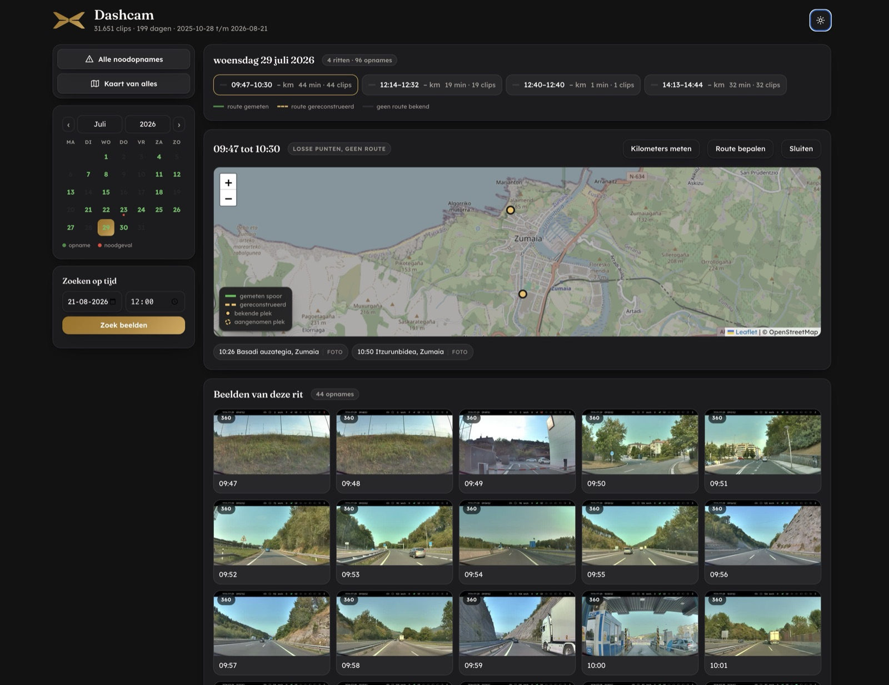
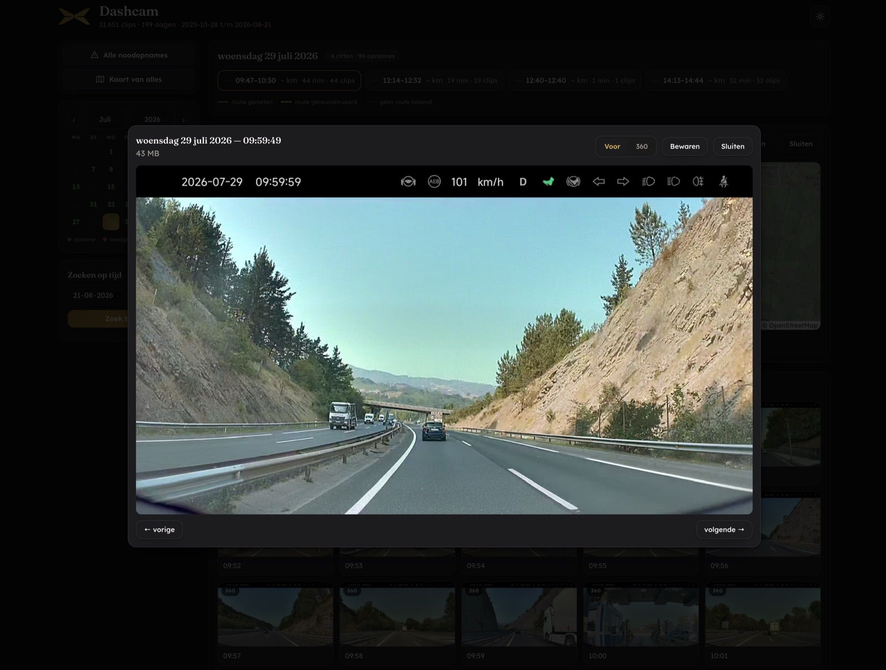

# XPENG Dashcam Viewer

A small self-hosted web app that turns a pile of XPENG dashcam files into something
you can actually browse: per day, per trip, with thumbnails, distance and a map.

It runs entirely on your own machine. Nothing is uploaded anywhere.

---

## What it looks like



*A day with four trips. Pick a trip and you get the map, the anchor points and every
clip as a thumbnail.*



*The player. Switch between the front camera and the 360 view, or download the clip.*

---

## What it does

- **Browse by day.** A calendar shows which days have footage. Pick a day, see the clips.
- **Trips instead of clips.** Recordings that follow each other closely are grouped into
  one trip, so you get "a drive" rather than 40 loose one-minute files.
- **Thumbnails.** One preview image per clip, made with `ffmpeg`.
- **Distance from the image.** The dashcam prints the speed in a black bar on the video.
  The app reads those digits and adds them up into kilometres. It compares the pixels to
  known samples rather than doing general text recognition, which is faster and exact.
- **Normal and emergency recordings** are kept apart.
- **Search by time.** Jump straight to "what did I record around 14:20 last Tuesday".
- **Player** with the front camera and, if your model records it, the 360 view.
- **Download** any clip.
- **Light and dark theme**, and a **Dutch / English** switch that remembers your choice.

### Optional extras

These need something outside the app and are switched off unless you configure them:

- **Routes on a map.** If you run a location logger, the app draws where you actually
  drove. Measured GPS points and inferred points are always kept visibly separate — the
  app never presents a guess as a measurement.
- **Photo locations.** The app can read *only* the timestamp and coordinates from a photo
  library to give a trip a location. It never reads or stores file names, IDs or images,
  and it never modifies the library.
- **Reminder.** A script that notifies you when the archive falls behind, so new trips do
  not pile up unmatched.

---

## Requirements

| | |
|---|---|
| Python | 3.11 or newer |
| ffmpeg | required for thumbnails and for reading the speed |
| Disk | roughly 1 % of your footage size, for thumbnails and the index |
| OS | macOS and Linux. Windows is untested. |

The app itself needs only three Python packages: `fastapi`, `uvicorn` and `httpx`.

---

## Quick start

```bash
git clone <your-fork-url> xpeng-dashcam-viewer
cd xpeng-dashcam-viewer
./setup.sh
./run.sh
```

Then open <http://127.0.0.1:8965>, click the **gear icon**, and point the app at the
folder that holds your dashcam files. Press **Test folder** — it tells you straight away
how many usable clips it can see.

Full details, including how to import footage from the USB stick, are in
**[INSTALL.md](INSTALL.md)**.

### Try it without your own footage

The repository ships with one demo day: two trips, 28 clips, thumbnails and a map.

```bash
./.venv/bin/python load_demo.py
```

Then start the viewer and pick **13 August 2026**.

The demo video is deliberately blurred, so nothing of the real surroundings is
recognisable, and the route on the map is **invented** — it does not correspond to where
the footage was taken. Because blurring destroys the on-screen speed digits, the demo
day carries its distances as stored values instead of reading them from the image.

---

## Where your files live

The app never moves or changes your footage. It only reads it and keeps a small SQLite
index in `data/`.

Your folder layout does not matter. The scan walks every sub-folder, and the date and
time come from the **file name**, not from the folder or the file date. A file date is
the moment you copied it, which is usually wrong.

Both of these work equally well:

```
/my/footage/XP_DCIM/2025/10/DVR_20251028112014305_front.mp4
/my/footage/DVR_20251028112014305_front.mp4
```

If your files are not in `XP_DCIM` / `XP_EMER_DCIM`, leave those two fields empty in the
settings screen and the app scans the main folder itself.

---

## Privacy

- Everything runs locally. There is no account, no telemetry and no external upload.
- `config.json` holds your own paths and, optionally, your home coordinates. It is
  **git-ignored** — keep it that way.
- Map tiles are fetched from a public tile service, so that service sees which map area
  you look at. Routes are matched using public routing services. If that matters to you,
  leave the routing options empty; the rest of the app works without them.

---

## Licence

MIT — see [LICENSE](LICENSE). Use it, change it, ship it; just keep the copyright notice.

### Third-party components

These keep their own licences:

| Component | Licence |
|---|---|
| [Leaflet](https://leafletjs.com) 1.9.4 | BSD-2-Clause |
| Fraunces and Lexend Deca (in `static/fonts/`) | SIL Open Font License 1.1 |
| Map tiles | © OpenStreetMap contributors, ODbL |
